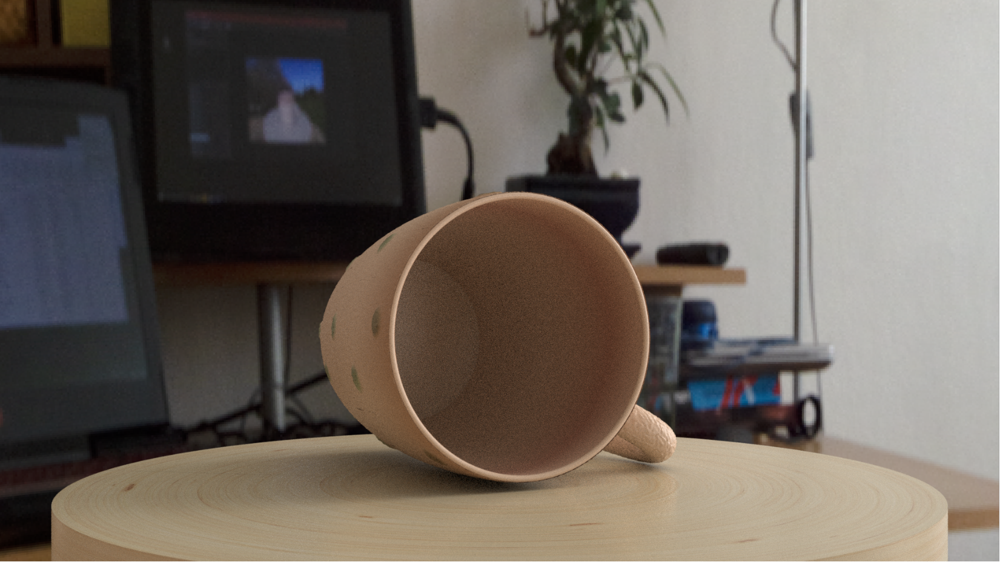
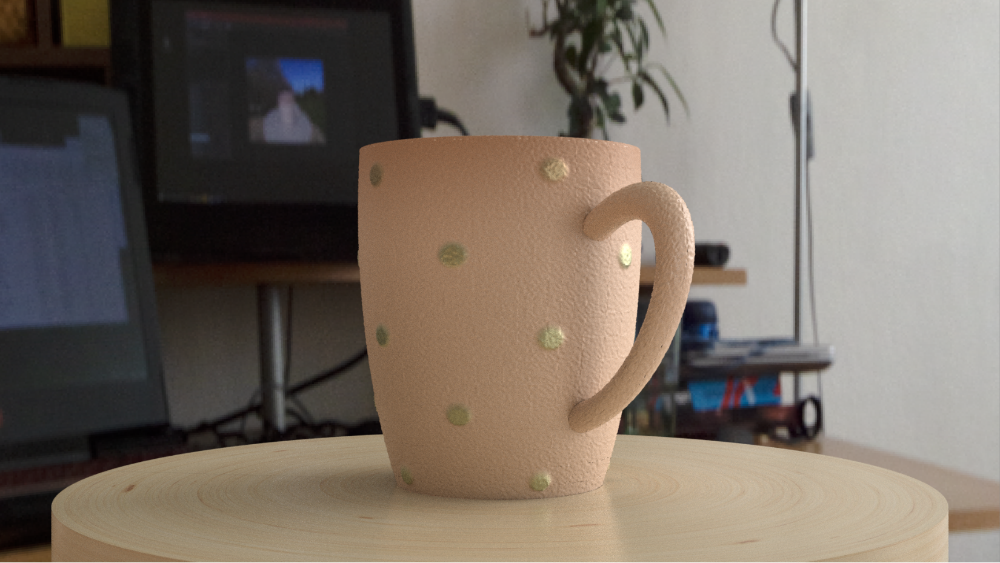

# Renderman Project
This is a project created in python using Renderman API.

<em>This is only reference image. For full HD image check MyCupRender1 images.</em>

<em>This is only reference image. For full HD image check MyCupRender2 images.</em>

The cup is modelled from the real-life reference: 

The model is placed to the scene with the self created HDRI map:

##Installation
To run the project its necessary to have Renderman and Python 2.7 or 3.7 installed. Run the project with command 
> python myCup.py

All the shaders are created in .osl which are then compiled to .oso so for updating use oslc command before compiling the project.
